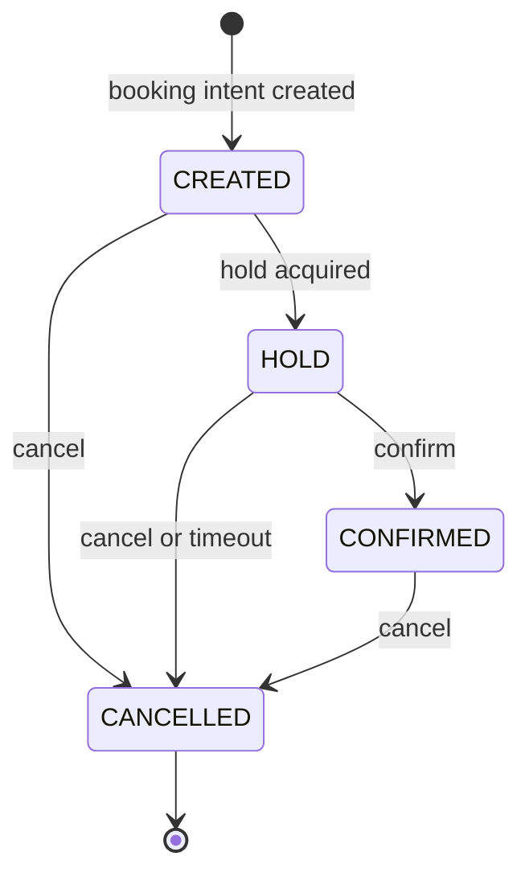

# ADR-002: Simple Appointment Service — Four-State Booking

**Status**: Accepted  
**Date**: 2026-03-23  
**Deciders**: Solution Architect

---

## Context & Assumptions

The core correctness risk is a **race condition: two or more customers simultaneously see the same slot as available and both attempt to claim it**. The system must guarantee that at most one customer can hold any given slot at a time, and that a confirmed appointment is a **unambiguous assignment** and **durable** of a specific Service Bay and Technician to a specific time window.

This ADR defines the **concurrency control strategy** and **booking state machine** for the MVP flow, and establishes the **extensibility contract** that allows future search modes to be introduced without changing the hold or confirmation logic.

---

## Scope

### In Scope

The MVP booking flow handles a single, user-directed interaction:

1. **User provides an exact slot** — the request carries `slot_start_time`, `slot_end_time`, `service_type_id`, and `dealership_id`.
2. **System finds exactly one matching availability result** — the Availability Service confirms whether a bay and a qualified technician are both free for the exact requested window. It returns at most one slot result (available or not available).
3. **User confirms or cancels** — the user explicitly commits to the slot or abandons it.

This narrow scope drives the concurrency model: the system must protect the window between confirming availability (step 2) and user commitment (step 3). Without a hold mechanism, a race in that window causes silent double-booking or ambiguous errors that degrade UX.

### Out of Scope

The following search modes are **not implemented in MVP** but the design is explicitly required to accommodate them without modification to the hold/confirm/cancel state machine:

- **Range-based search**: query all available slots within a time window (e.g., "any time between 09:00 and 17:00 on any day this week") and return a list of candidates.
- **Background / polling search**: the client periodically re-fetches availability to surface newly freed slots (e.g., after a cancellation frees a slot that was previously held).
- **Best-slot recommendations**: the system selects and ranks slots by a heuristic (soonest available, least loaded technician, preferred technician) and presents a prioritised list.
- **Advanced timeout policy**: the MVP includes a fixed hold TTL that auto-cancels expired holds, but richer timeout behaviour such as user reminders, grace periods, or recovery from partial client or network failure is out of scope.
- **Idempotency**: user accientally hit booking 2 times

The implementation must **expose search and hold as separate, independently callable operations** so that any of the above search modes can call the same hold endpoint without modification.

---

## Decision

Adopt a **four-state appointment state machine** with the following states:

- `CREATED`
- `HOLD`
- `CONFIRMED`
- `CANCELLED`

The system records an appointment entity as soon as the booking intent is created, then transitions that entity through hold, confirmation, or cancellation. This keeps the lifecycle explicit, makes timeout and user-abandonment behaviour observable, and gives the Appointment Service a stable aggregate identity before resource reservation occurs.

### State Definitions

| State       | Meaning                                                                                                                                                                                      | Resource allocation                                                                                  |
| ----------- | -------------------------------------------------------------------------------------------------------------------------------------------------------------------------------------------- | ---------------------------------------------------------------------------------------------------- |
| `CREATED`   | The appointment request exists, but no exclusive slot reservation has been granted yet. The customer has expressed booking intent for a dealership, service type, and requested time window. | No bay or technician is reserved.                                                                    |
| `HOLD`      | The system has successfully reserved the requested slot for a short TTL window while awaiting user commitment.                                                                               | A specific bay and technician are reserved exclusively until confirmation, cancellation, or timeout. |
| `CONFIRMED` | The held slot has been committed by the user and is now a durable appointment.                                                                                                               | The bay and technician assignment is durable and blocks further bookings for that time window.       |
| `CANCELLED` | The appointment lifecycle has been terminated, either by explicit user action or hold timeout.                                                                                               | No active reservation remains.                                                                       |

### State Diagram

### Allowed Transitions

| From        | To          | Trigger                                                 | Why it is allowed                                                                                                |
| ----------- | ----------- | ------------------------------------------------------- | ---------------------------------------------------------------------------------------------------------------- |
| `CREATED`   | `HOLD`      | Hold request succeeds                                   | The system has re-validated availability and reserved a concrete bay and technician.                             |
| `CREATED`   | `CANCELLED` | User abandons request or explicitly cancels before hold | This avoids orphaned in-progress records and supports explicit abandonment without ever reserving resources.     |
| `HOLD`      | `CONFIRMED` | User confirms before TTL expiry                         | The reservation is committed into a durable appointment.                                                         |
| `HOLD`      | `CANCELLED` | User cancels or hold TTL expires                        | Resources must be released cleanly when the user backs out or does not complete checkout in time.                |
| `CONFIRMED` | `CANCELLED` | User or dealership cancels confirmed appointment        | A real booking system must support post-confirmation cancellation without inventing a second cancellation model. |

### Invalid Transitions

The following transitions are rejected:

- `CREATED -> CONFIRMED`: confirmation without a hold bypasses the concurrency safety window.
- `HOLD -> CREATED`: once a reservation exists, rolling back to an unreserved state creates ambiguity and complicates auditability.
- `CONFIRMED -> HOLD`: a confirmed appointment is already the committed reservation; demoting it to a temporary hold weakens correctness semantics.
- `CANCELLED -> *`: cancellation is terminal in the MVP model. Rebooking must create a new appointment aggregate.

### Why `CREATED` Exists

We considered collapsing the flow to a simpler three-state machine: `HOLD -> CONFIRMED -> CANCELLED`. That is operationally simpler, but it loses important domain signals.

**Decision:** keep `CREATED` as a first-class state.

**Benefits:**

- Preserves an explicit record of booking intent before any scarce resource is reserved.
- Makes the workflow easier to observe and audit, especially when users abandon the journey before hold acquisition.
- Supports idempotent APIs more cleanly because a client can create an appointment intent once and retry hold acquisition safely.
- Leaves room for future pre-hold validations without changing the state model, such as customer eligibility checks or pricing validation.

**Trade-offs accepted:**

- Adds one extra persisted lifecycle state and therefore slightly more orchestration logic.
- Introduces the need to clean up or age out stale `CREATED` records if users abandon the flow early.
- Requires clear API semantics so clients understand that `CREATED` does not imply any reserved capacity.

This trade-off is acceptable because the additional clarity and extensibility are more valuable than the small increase in lifecycle complexity.

### Timeout Behaviour

`HOLD` is a time-bound state. If the user does not confirm before the configured TTL expires, the system transitions the appointment from `HOLD` to `CANCELLED` automatically.

This decision favors correctness and capacity recovery over keeping abandoned reservations alive:

- It prevents scarce slots from being blocked indefinitely.
- It gives the user a deterministic outcome instead of an ambiguous stale hold.
- It allows future polling or range-search clients to discover the slot again once cancellation has occurred.

### Concurrency Semantics by State

- `CREATED` does not block availability and must not participate in overlap constraints.
- `HOLD` blocks the assigned bay and technician for the target time window and must participate in overlap constraints.
- `CONFIRMED` blocks the assigned bay and technician durably and must participate in overlap constraints.
- `CANCELLED` releases all blocking semantics and remains only for audit/history.

### Operational Notes

- The hold acquisition transition `CREATED -> HOLD` must be the only transition that assigns concrete resources.
- The confirmation transition `HOLD -> CONFIRMED` must validate that the hold has not expired.
- Cancellation must be idempotent. Repeated cancel requests for an already cancelled appointment should not recreate side effects.
- Any reschedule in the future should be modeled as canceling the existing appointment and creating a new appointment intent rather than mutating the state machine.
