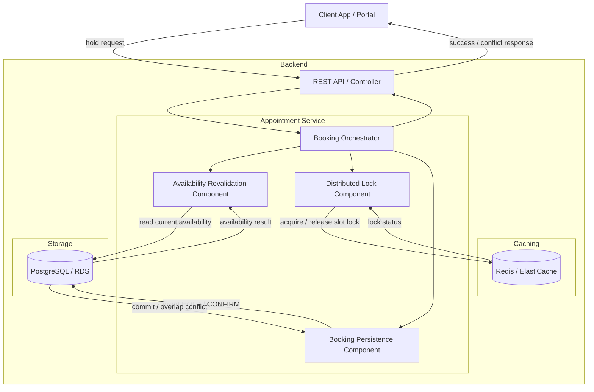

# ADR-003: Defense-in-Depth Booking for MVP

**Status**: Accepted  
**Date**: 2026-03-23  
**Deciders**: Solution Architect

---

## Problem Summary

The MVP booking flow must prevent double-booking for the same time window while remaining simple enough to build and operate quickly. The main technical risk is a race condition: two customers can see the same slot as available and attempt to reserve it at nearly the same time.

For MVP, the booking journey is deliberately narrow:

1. The user requests one exact slot.
2. The system evaluates whether one qualified technician and one service bay are free.
3. The system places a short-lived hold.
4. The user confirms or cancels.

This document focuses on three things:

- the defense mechanisms that keep booking correct under concurrency
- the MVP tech stack used to implement those mechanisms
- the trade-offs of this design

Appointment lifecycle semantics and the reason for choosing a state machine are already defined in [ADR-002-simple-appointment-service.md](ADR-002-simple-appointment-service.md). They are treated as an input to this ADR and are not repeated here.

## Decision

Technology choices such as Redis/ElasticCache, PostgreSQL/RDS, and API Gateway are treated here as assumed platform defaults for interview-MVP simplicity. This document does not attempt a full comparison against alternative technologies. The focus is on the defense booking mechanism, not on infrastructure selection.

### High-Level Component Interaction

### Defense Mechanism

The MVP booking flow uses three layers of protection around the `CREATED -> HOLD` transition. The design combines fresh availability checks, short-lived contention control, and an authoritative database commit.

The three layers are:

1. **Availability revalidation** against PostgreSQL immediately before any reservation attempt.
2. **Short-lived distributed lock** in Redis for the slot being claimed.
3. **Constraint-based optimistic concurrency** in PostgreSQL when writing `HOLD` or `CONFIRMED`.

Each layer addresses a different failure mode: stale reads, cross-instance races, and final overlap enforcement.

#### Layer 1: Availability Revalidation

Before placing a hold, the Booking Orchestrator re-checks whether a qualified technician and service bay are still free for the requested time window. This protects against stale search results.

**Responsibility:**

- Recompute availability for the exact requested slot.
- Resolve the concrete technician and bay candidate for the request.
- Reject early if no valid resource pair remains available.

**Why this layer exists:**

- It avoids taking a lock for obviously unavailable requests.
- It narrows the critical section to only requests that still have a realistic chance of succeeding.
- It ensures the hold is based on fresh data, not a cached search result.

#### Layer 2: Distributed Slot Lock

If revalidation succeeds, the service acquires a short-lived distributed lock in Redis before writing the hold. For MVP, the lock is scoped to the dealership, time window, and selected resource combination.

**Responsibility:**

- Serialize competing hold attempts for the same slot claim across multiple API instances.
- Reduce duplicate work and conflicting writes during traffic spikes.
- Ensure the lock expires automatically if the process crashes or loses the lock before cleanup.

**Why this layer exists:**

- In a horizontally scaled service, two requests can pass revalidation at nearly the same moment.
- Application memory locks are not sufficient because requests may hit different service instances.
- Redis provides simple cross-instance coordination for MVP.

**MVP design rule:**

- The Redis lock is a contention-control mechanism, not the final source of truth.
- Lock TTL must be short and bounded so abandoned or crashed flows do not block booking indefinitely.

#### Layer 3: Database Commit

After the lock is acquired, the service attempts to write the `HOLD` record in PostgreSQL. PostgreSQL must reject overlapping active reservations for the same technician or bay in the same time window.

This layer uses **optimistic locking strategy**: the service attempts the write and the database rejects conflicts at commit time. `HOLD` and `CONFIRMED` participate in overlap protection; `CREATED` and `CANCELLED` do not.

**Responsibility:**

- Persist the concrete reservation attempt durably.
- Enforce the final no-double-booking rule.
- Return a conflict if another request committed first.

**Why this layer exists:**

- Distributed locks can handle high contention period but it can expire, be released incorrectly, or fail during network partitions.
- Revalidation is only a point-in-time check.
- The database is the only authoritative place that can enforce overlap rules conclusively.

#### End-to-End Hold Workflow

1. The client submits a hold request for one exact slot.
2. The Booking Orchestrator revalidates current availability in PostgreSQL.
3. If no technician-bay pair is available, the request fails with conflict.
4. If availability still exists, the orchestrator acquires a Redis lock for the slot claim.
5. Once the lock is held, the service attempts to persist the `HOLD` record in PostgreSQL.
6. If the write succeeds, the hold is created and a hold expiry time is returned.
7. If PostgreSQL detects an overlap conflict, the request fails and the lock is released.
8. On user confirmation, the appointment transitions from `HOLD` to `CONFIRMED` after verifying the hold is still valid.
9. On user cancellation or TTL expiry, the appointment transitions from `HOLD` to `CANCELLED`, releasing blocking semantics.

#### Failure Handling and Why the Layers Work Together

This design assumes any single control can fail.

- If the client submits based on stale search results, revalidation catches it.
- If two requests pass revalidation concurrently on different app instances, the Redis lock reduces the race to one in-flight writer.
- If both requests still reach persistence, PostgreSQL rejects the losing write.
- If a process crashes after acquiring the lock, Redis TTL prevents permanent deadlock.
- If a user abandons checkout after a successful hold, the appointment TTL transitions it to `CANCELLED`, restoring capacity.

That is why the design is defense in depth rather than a single locking strategy.

#### Why This Is the Right MVP Design

This design optimizes for booking correctness while staying simple enough for MVP delivery.

**Benefits:**

- Prevents silent double-booking in the narrow exact-slot MVP flow.
- Keeps the booking-critical path synchronous and easy to reason about.
- Uses simple, widely available infrastructure: Redis for lock coordination and PostgreSQL for durable enforcement.
- Aligns with ADR-002 by making `HOLD` the only temporary blocking state before durable confirmation.

**Trade-offs accepted:**

- The flow is more complex than a database-only insert path.
- Redis introduces operational overhead and requires careful TTL tuning.
- Availability revalidation adds one more read on the booking-critical path.

These trade-offs are acceptable because incorrect booking under concurrency is the main business risk.

#### Future-Ready Notes

The same mechanism can support near-term extensions without changing the core state machine:

- **Idempotent hold requests** by attaching an idempotency key to the appointment intent.
- **Retry-safe confirmation** by making `HOLD -> CONFIRMED` idempotent.
- **Range-search or polling clients** because search and hold remain separate operations.

These are deferred, but the design does not block them.
